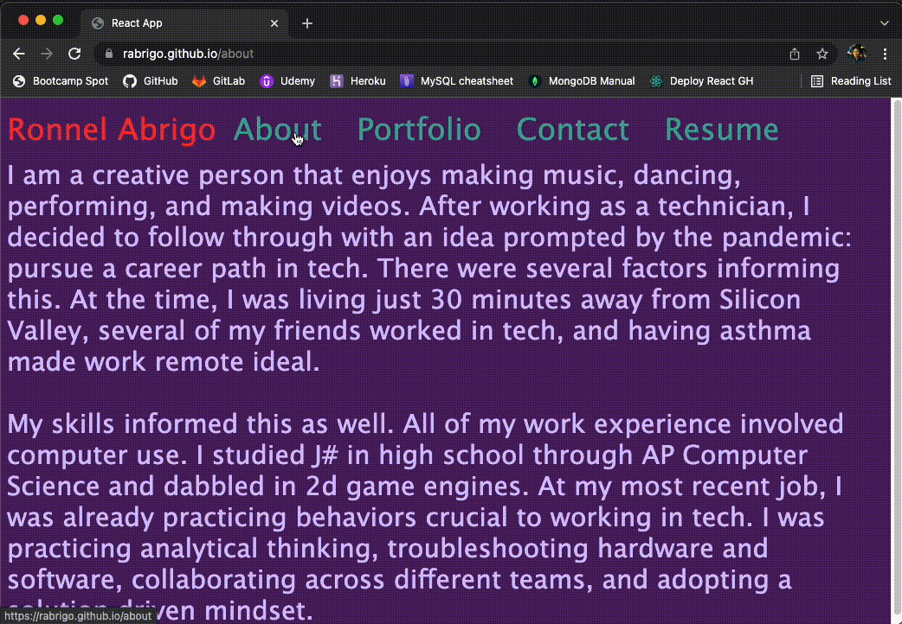
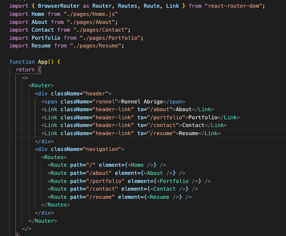
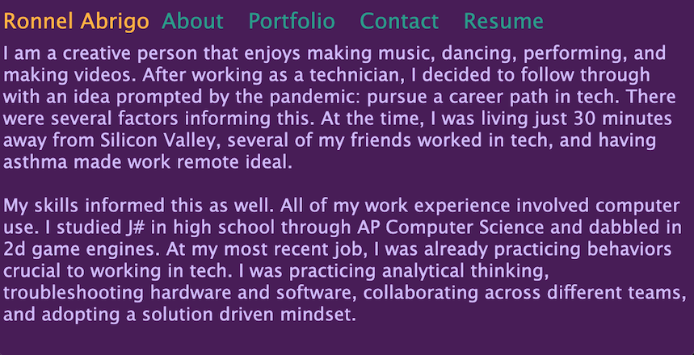
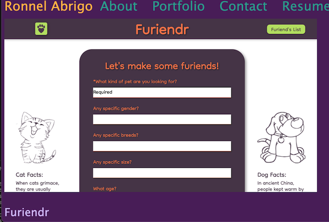
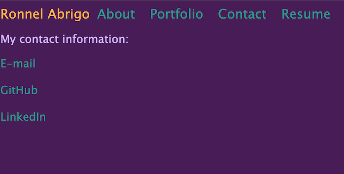
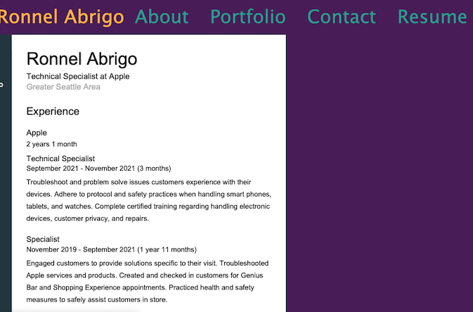

# React Portfolio

https://rabrigo.github.io/react-portfolio/

Table of Contents

  <ol>
    <li><a href="#description">Description</a></li>
    <li><a href="#built-with">Built With</a></li>
    <li><a href="#installation">Installation</a></li>
    <li><a href="#usage">Usage</a></li>
    <li><a href="#future-updates">Future Updates</a></li>
  </ol>

## Description
A straight forward portfolio page implenting React to render the front end. This page consists of a header and navigation element. The page does not change but the navigation will render a different component depending on which link is clicked, as seen in the gif up top. 

## Built With
React.js was used to make the front end responsive. React Router facilitated linked the header links to the components. This page was successfully deployed on GitHub thanks to https://create-react-app.dev/docs/deployment/#github-pages

## Installation
You can clone a copy of this app onto your local machine. From there, run `npm i` or `npm install` from the root folder of the app in your command line interface. Run `npm run start` to run the webpage locally.

Or you can visit this url to see the deployed app: https://rabrigo.github.io/react-portfolio/

## Usage
Click on the different links to be routed to different components. 

Do not attempt to visit those routes as URL's, they are not links.

## Future Updates
Further styling of the page.
